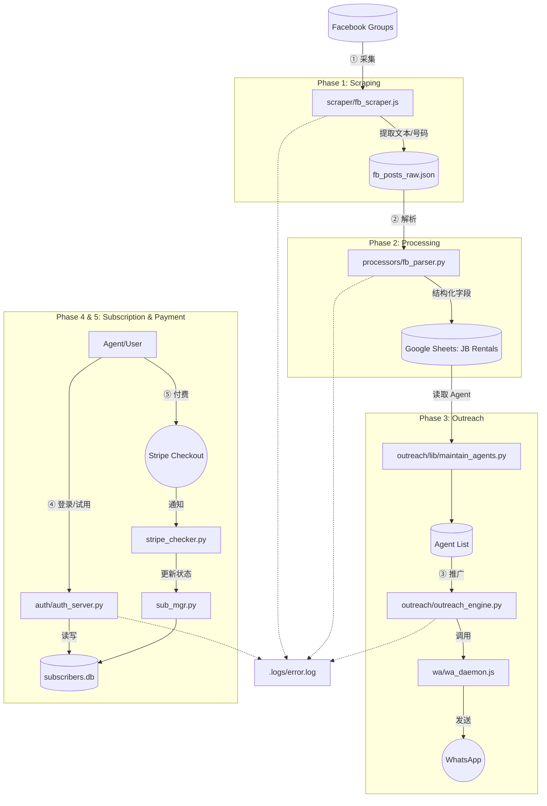
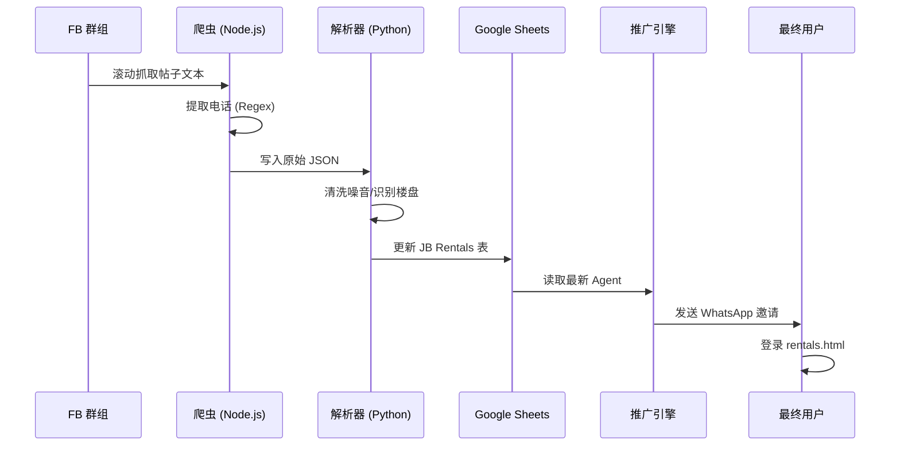

# ARCHITECTURE.md — Smart Tenancy Pro 全景架构

## 🗺️ 系统拓扑图

## 🌊 核心数据流

## 🧩 模块依赖与状态边界

- **Global Context (全局状态):** 
    - `subscribers.db`: 订阅者生命周期。
    - `Google Sheets`: 房源与推广记录的 SSOT。
    - `.env`: 敏感凭据 (Stripe/Google Key)。
- **Local State (局部状态):**
    - `wa_session/`: WhatsApp 认证会话。
    - `fb_posts_raw.json`: 采集阶段的中间缓存。
    - `.form_processed.json`: 注册表单处理位点。

## 🚨 日志与异常边界

- 所有的核心服务 (Auth, Scraper, Parser, outreach) 必须捕获异常并写入 `.logs/error.log`。
- 调用深度严禁超过 4 层（例如：Engine -> Sender -> Notify -> Daemon ✅）。
